# Administración de Sistemas Linux - Iteración 2.0: CyberTech Solutions 🛡️

Esta es una versión optimizada de la infraestructura de **CyberTech Solutions**, enfocada en la seguridad avanzada, el cumplimiento del estándar FHS y la automatización de auditorías.

## 🏗️ 1. Infraestructura y Jerarquía (FHS)
Se ha migrado el proyecto al directorio `/opt` para seguir las mejores prácticas de software opcional. Se utiliza una estructura jerárquica para separar datos sensibles.

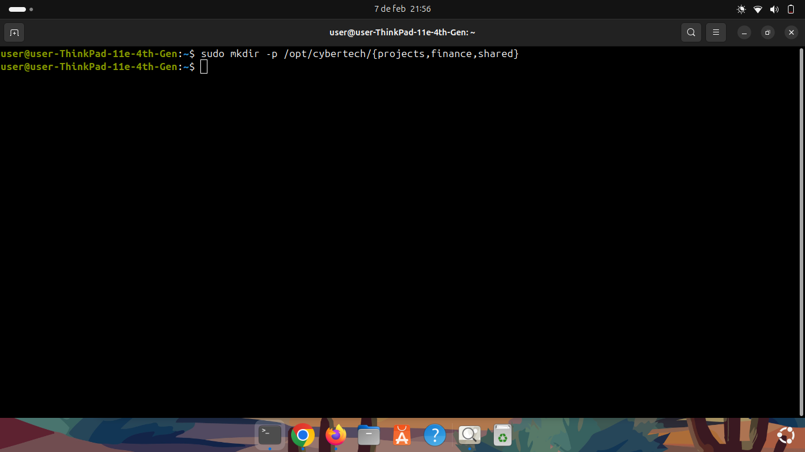
*Despliegue de directorios departamentales mediante el uso de `mkdir -p`.*

## 👥 2. Gestión de Identidades (RBAC)
Implementación de un control de acceso basado en roles (RBAC) utilizando prefijos de grupo para una administración organizada.

*Creación de grupos técnicos con el prefijo `ct_` para estandarización.*

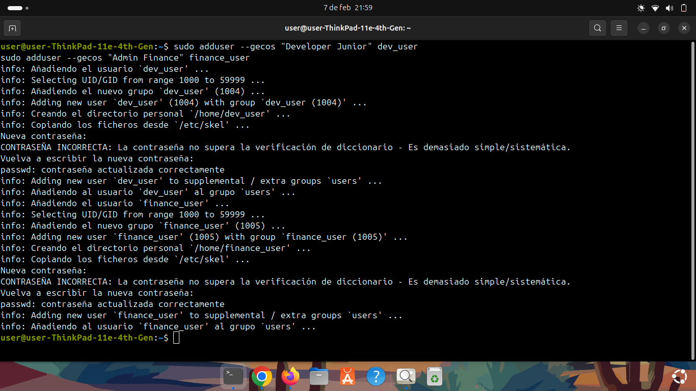
*Registro de empleados con metadatos descriptivos (GECOS).*

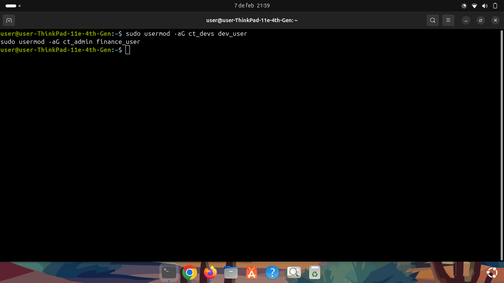
*Asignación de privilegios departamentales mediante la gestión de grupos secundarios.*

## 🔐 3. Políticas de Acceso y Privacidad
Aplicación del **Principio de Menor Privilegio**. Cada departamento tiene aislamiento total de sus archivos.

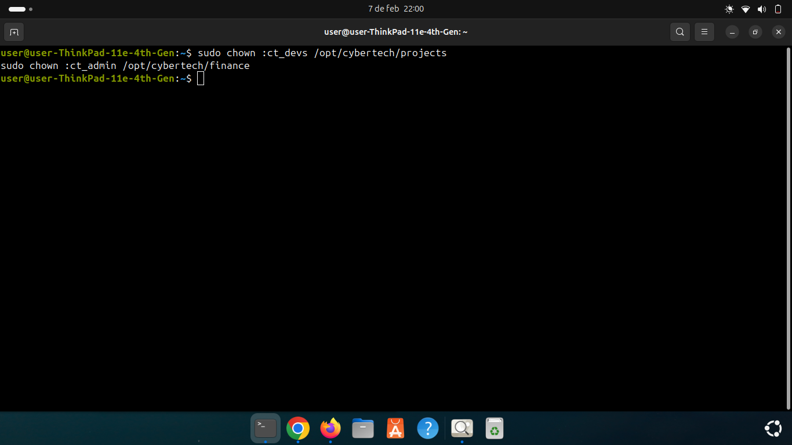
*Transferencia de propiedad de directorios a sus respectivos grupos técnicos.*

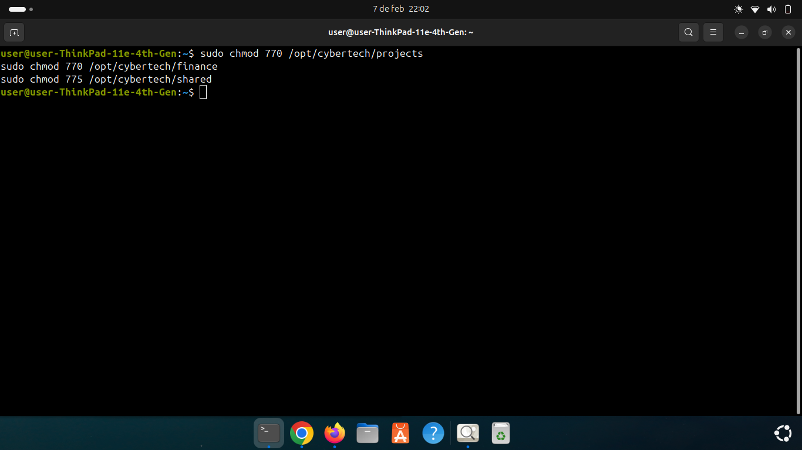
*Configuración de bits de permisos 770 y 775 para el aislamiento de datos.*

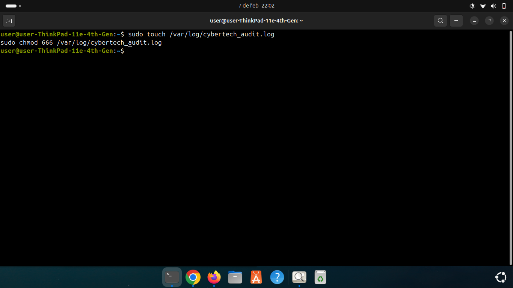
*Auditoría visual de la máscara de permisos final.*

## 🤖 4. Auditoría y Automatización
Configuración de un sistema de registro automático para monitorear la actividad de los usuarios en tiempo real.

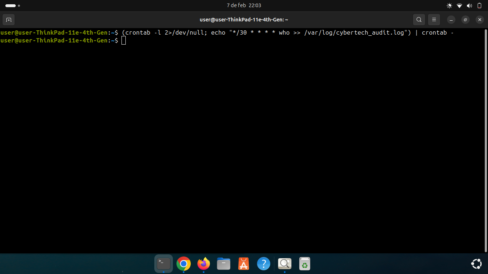
*Implementación de Cron Jobs para la recolección automática de logs en /var/log.*

## 🧪 5. Pruebas de Seguridad (Vectores de Acceso)
Validación de las reglas de negocio y restricciones de seguridad impuestas.

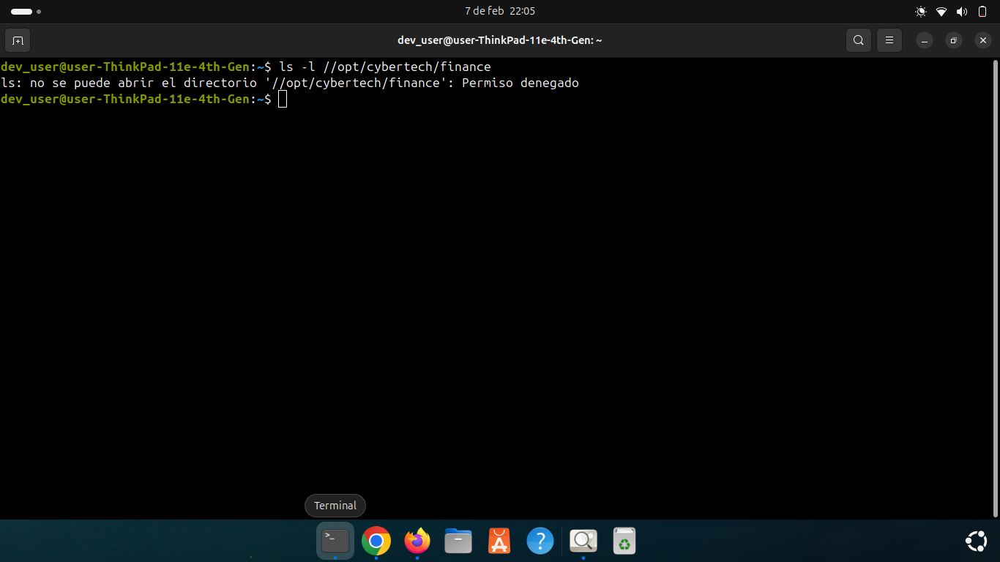
*Test A: Intento de acceso no autorizado entre departamentos (Resultado: Exitoso/Denegado).*

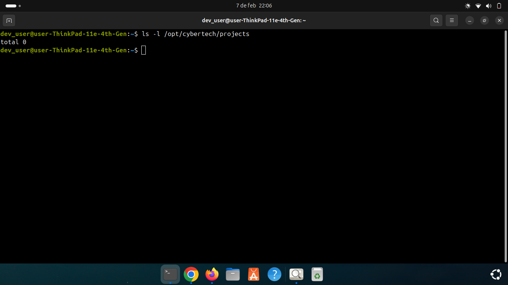
*Test B: Verificación de operatividad del usuario dentro de su entorno permitido.*

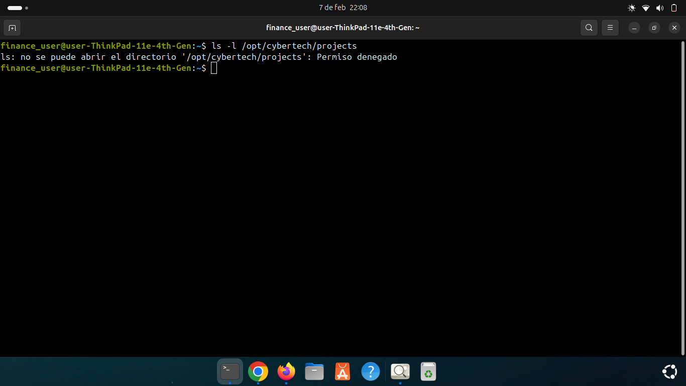
*Test C: Validación de barreras de privacidad entre administración y desarrollo.*

## 🚫 6. Gestión de Bajas y Suspensión
Protocolo de seguridad para la inactivación de cuentas sin pérdida de integridad de datos.

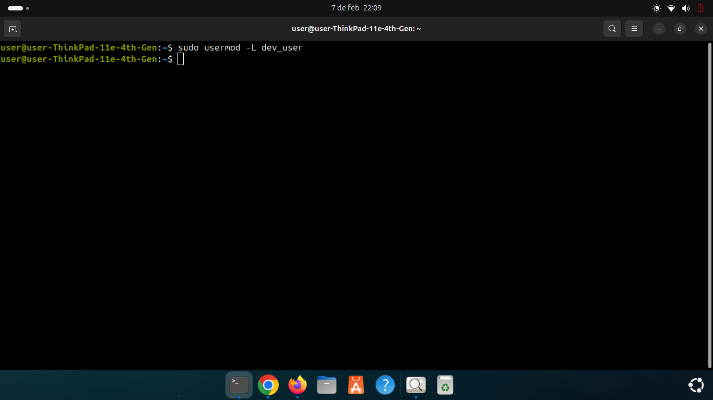
*Suspensión inmediata de credenciales desde la cuenta de administrador.*

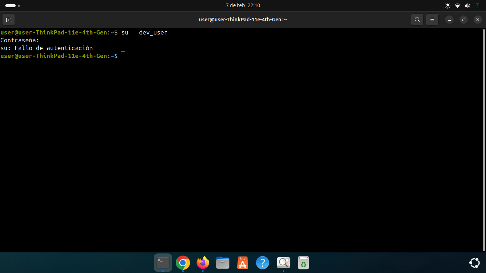
*Confirmación de inactividad de cuenta: acceso denegado post-bloqueo.*

